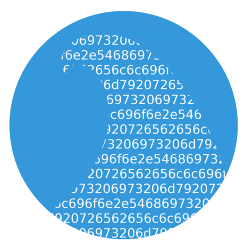

# Bitwave

##Decentralized web browsing

###By Dean Dunbar and Harris Dagha

#What is Bitwave?

Bitwave was the first place winner of the Texas Million Dollar Bitcoin Hackathon. Bitwave is a Decentralized web browsing application built on top of blockchain technology. (Yes bitcoins are not just “internet money”) Bitwave allows the user to browse a decentralized internet. Version 2 will include routing that will allow users and publishers to remain anonymous and secure. Version 3 Includes Distributed trusted computing execution that runs code in a blackbox that is spread out over the network users.

#Why is bitwave needed?

	-Faster Browsing Speeds
	-Anonymous Communication (Makes surveillance extremely difficult)
	-Self Scaling & Decentralized
	-Protected from ISP throttling
	-Protected from censorship (both self and state)
	-Guarantee the existence of the internet as a free and open tool.

Content publishers use html2bwml converter. (html to bitwaveML)
https://github.com/deandunbar/html2bwml
